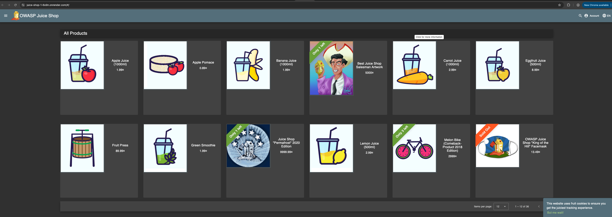
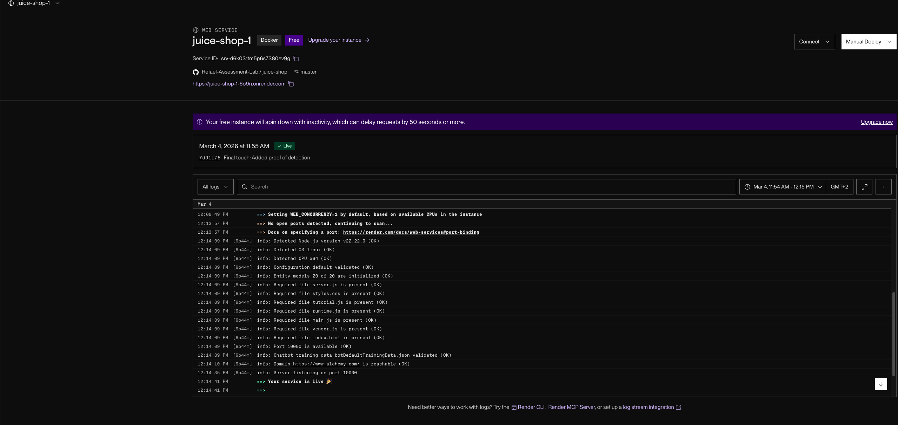

# My Cycode Assessment - Juice Shop Project

## Project Overview

I successfully deployed the OWASP Juice Shop using Docker on Render to simulate a modern, vulnerable cloud-native environment and analyzed it using the Cycode ASPM platform.

Live Application
Deployment Platform: Render (PaaS)

Application URL: 
https://juice-shop-1-6o9n.onrender.com 

## Project Screenshots

# Discussion Questions

1. Is there anything wrong with committing directly to master?

Yes, it is a critical security risk. Direct commits bypass the **"Shift Left"** security philosophy. They circumvent mandatory peer reviews and automated security gates (SAST, SCA, and Secret Scanning). In a production environment, this allows vulnerabilities or hardcoded secrets to reach production without any oversight, potentially leading to a supply chain attack.

2. How would you prevent that?
   
I would implement **Branch Protection Rules** to enforce:

* Mandatory Pull Requests: No code reaches master without at least one approval.

* Required Status Checks: Automated security scans must pass before merging.

* Signed Commits: Ensuring the integrity and authorship of the code.

3. Repository Settings Changes

In a real-world scenario, I would implement a CODEOWNERS file to mandate reviews from security experts for sensitive directories. I would also enable Push Protection to block developers from accidentally pushing secrets to the remote repository in real-time.

# Final Walkthrough & Security Findings

**Connection Process**
Integrated Cycode via GitHub App using a dedicated Organization for full SDLC visibility (Code, Build, and Issues).

**Platform Overview**
Utilized Cycode as an ASPM (Application Security Posture Management) solution to consolidate security findings and map the software supply chain.

**Key Findings**
* Secrets: Identified exposed tokens in the commit history through historical scanning.

* SAST: Detected critical vulnerabilities including SQL Injection and XSS within the application logic.

* SCA: Flagged outdated dependencies and vulnerable libraries with known CVEs.

**Final Proof of Detection**
* Status: Violation Successfully Detected.

* Finding: Generic Secret/Password found in security_test.txt.

* Impact: Confirmed real-time secret scanning is active and reporting correctly to the ASPM dashboard.
